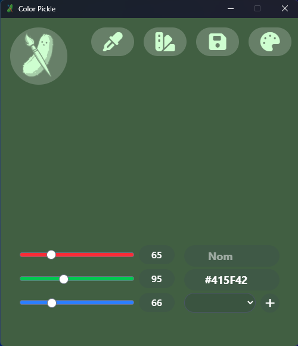
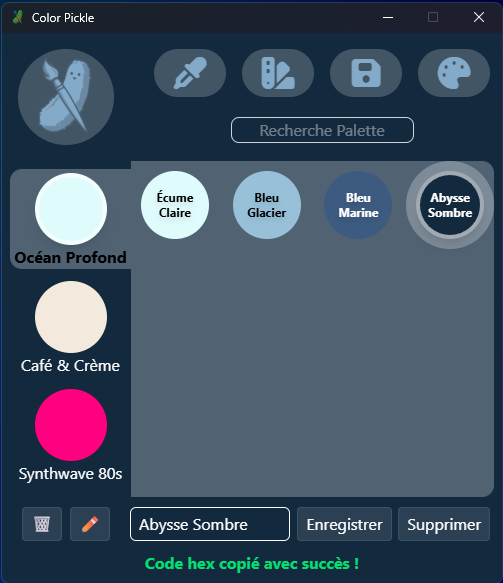
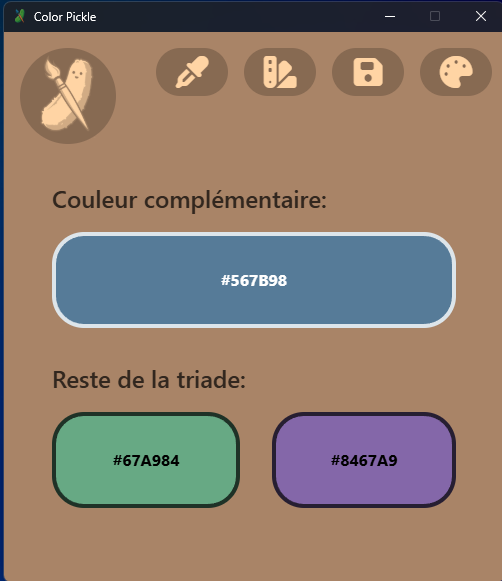
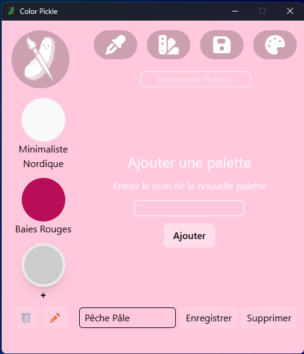

# ColorPickle - Gestionnaire de Palettes de Couleurs

Application de bureau developpee avec Tauri 2 et Vue 3 permettant de creer, personnaliser, convertir et gerer des palettes de couleurs.

Projet realise pour le travail pratique 2 et 3 dans le cadre du cours Développement d'application (bureau)  
Présenté à Mme Lilia Ould Hocine  
(AEC en Developpement Web / Programmation - College de Maisonneuve).  
<br>


<br>

# 1. STACK TECHNIQUE


* Framework Desktop : Tauri 2 (avec backend minimal Rust)
* Framework Frontend : Vue 3 (Composition API, `<script setup>`)
* Langage : TypeScript / HTML5 / CSS3 / Rust
* Outil de Build : Vite
* Gestionnaire de paquets : npm
* Routage : Vue Router

Note sur TypeScript : Bien que l'enonce mentionne JavaScript, le projet utilise TypeScript pour assurer un typage strict des structures de donnees (Palette, Couleur) et eviter les erreurs de conversion au runtime.

<br><br>

# 2. INSTALLATION ET LANCEMENT


Prerequis :
* Node.js (version LTS recommandee)
* Rust & dependances systeme Tauri (necessaires pour executer le backend natif)

## Procedure :
#### 1. Installer les dependances frontend et backend :
   ```
   npm install
   ```

#### 2. Lancer l'application en mode developpement :
   ```
   npm run tauri dev
   ```

#### 2-Alt. Créer un build de l'application et lancer le .exe :
   ```
   npm run tauri build
   
   puis lancer le .exe directement du dossier src-tauri/target/release/
   ```

Une fenetre de bureau native s'ouvrira avec l'interface Vue.js.
<br><br><br>

# 3. FONCTIONNALITES DU TP2 + TP3 (mise à jour consolidée)


## 1. Survol de la navigation a 3 Vues :
   * Une barre de navigation accessible de toutes les pages:
     * Un bouton color picker qui permet de sélectionner une couleur sur l'écran de l'utilisateur.
     * Un bouton de navigation ouvrant la page Palettes.
     * Un bouton de sauvegarde qui permet d'exporter les données au format .json.
     * Un bouton de navigation ouvrant la page Utilitaires.
   * Accueil (AccueilView.vue) : Page principale affichant la couleur sélectionnée et offrant des opérations quant à celles-ci:
     * Des sliders permettent de modifier les valeurs rouge, bleu et vert de la couleur sélectionnée.
     * Un double-click sur le code hex de la couleur sélectionnée l'envoie au presse-papier.
     * Un formulaire d'ajout à une palette nécessitant un nom et un choix de palette. L'ajout se fait avec le bouton "+".
   * Palettes (PalettesView.vue) : Affichage de la collection complete de palettes:
     * Une liste des palettes enregistrées.
     * Sélectionner une palette montre les couleurs enregistrées dedans.
     * Un bouton pour supprimer une palette.
     * Un bouton pour renommer une palette.
     * Sélectionner une couleur dans une palette copie son code hex au presse-papier et la sélectionne comme couleur sélectionnée.
     * Un formulaire en bas de la section des couleurs permet de renommer une couleur sélectionnée ou de la supprimer de la palette.
     * Un champ de recherche en haut de la page permet de chercher le nom d'une couleur et d'afficher seulement les palettes qui contiennent cette couleur.
   * Utilitaires (UtilitairesView.vue) : Outil interactif de conversion et selection de couleurs lié à la couleur sélectionnée:
     * Un bouton couleur complémentaire affiche la couleur complémentaire, son code hex et copie au presse-papier sa valeur lorsque cliqué.
     * Deux boutons affichent les 2 autres couleurs qui composent la triade de la couleur sélectionnée, leur code hex et copie au presse-papier leur valeur lorsque cliqués.

## 2. Gestion des Donnees:
   * La fonction charger de stockage.rs charge le fichier de sauvegarde. Si il n'est pas trouvé des données d'exemples sont chargées. Ces données proviennent de src-tauri/data/palettes_exemple.json
   * Le service expose des methodes pour recuperer, ajouter, modifier, supprimer et filtrer les donnees sans charger directement les composants.

## 3. Formulaire avec Validation Frontend :
   * Formulaire complet dans AjoutPalette.vue permettant de creer et de modifier une palette.
   * Formulaire complet dans AccueilView.vue permettant d'ajouter une couleur à une palette.
   * Validation avant envoi : verification du champ nom obligatoire (non vide) et du code de couleur hexadécimal lors de l'ajoute à une palette.
   * Gestion des erreurs avec affichage dynamique des messages d'erreur ou de succes.

## 4. Interactions & Feedback Utilisateur :
   * Recherche et Filtres : Filtrage en temps reel des palettes par nom et nom de couleurs à l'intérieur de celles-ci.
   * Etats d'interface : Prise en charge des etats "liste vide", confirmation d'action et messages d'erreur/succes via MessageFooter.vue.
   * Divers effets sur les boutons donnent du feedback visuel sur les éléments interactifs.
  
## 5. Changements notables TP2 vs TP3 :
   * Au TP2 nous avions un Frontend prototype fonctionnel avec des données et des actions simulées, maintenant ce Frontend est lié à un backend en Rust avec une liaison par Tauri. Les données qui étaient simulées sont maintenant persistantes et sauvegardées à chaque opération.
   * Puisqu'on sauvegarde à chaque opération, notre bouton disquette était devenu redondant, il sert maintenant à exporter le fichier de sauvegarde et l'enregistrer ailleurs sur le PC de l'utilisateur.


<br><br><br>

# 4. STRUCTURE DU PROJET

Pour le detail complet de l'architecture et l'arborescence des fichiers, veuillez consulter le fichier:
<br>  
[architecture-application.md](./architecture-application.md)

<br>

# 5. Auteurs


Mathieu Gosselin  
Clement Laflamme  
Francis Boisvert  

# 6. Screenshots
### Ecran Principal

### Ecran des palettes

### Ecran des triades

### Ecran d'ajout d'une palette

